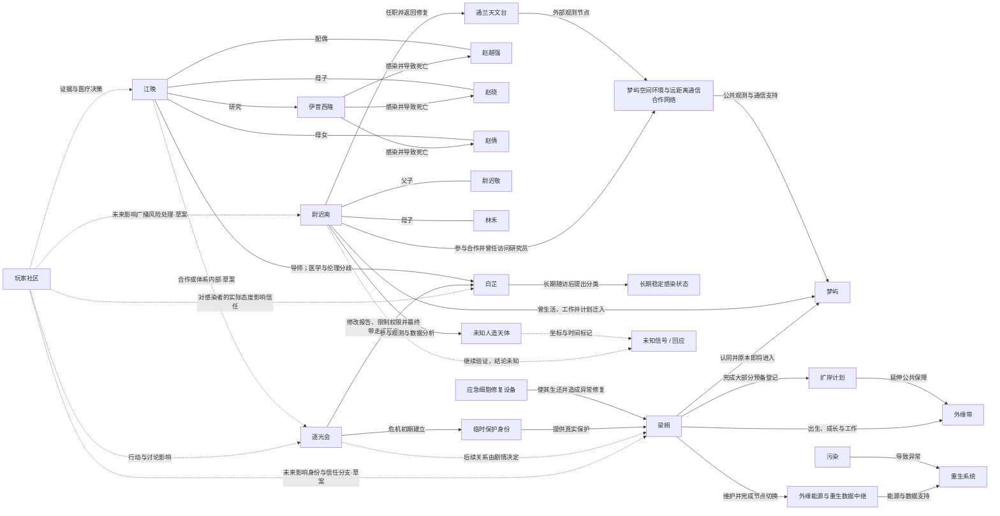

# 人物关系与关系图

状态：**初始草图，持续维护**

本目录用于保存人物、组织、地点、系统和重要现象之间的结构化关系。

机器可读数据见：[relationships.json](relationships.json)。

## 关系数据原则

每条关系应尽量记录：

- 起点 ID；
- 终点 ID；
- 关系描述；
- 确定程度；
- 生效阶段；
- 是否对玩家公开；
- 可能被哪些世界旗标改变。

当前 `certainty` 主要使用：

- `confirmed`：已确认。
- `confirmed_in_character_background`：人物原始背景已确认，但尚未完全整合进全局世界观。
- `confirmed_character_background`：本轮人物背景讨论中已确认。
- `confirmed_character_direction`：人物核心方向已确认，具体演出待设计。
- `confirmed_mainline_direction`：主线方向已确认，具体演出待设计。
- `confirmed_design_goal`：设计目标已确认。
- `draft`：讨论草案。
- `draft_from_background`：从背景推导出的支线草案。

## 当前 Mermaid 草图

该图只是规范和占位，不代表最终人物关系图。

## 江晚与白芷的师生关系

- **江晚 → 白芷**：江晚是白芷的正式导师，负责其专业训练、病例评审与研究方法指导。
- 两人都承认长期稳定病例具有观察价值，但对样本是否充分、结论何时公开以及公共风险如何承担存在分歧。
- 江晚认为错误公开尚未成熟的结论可能造成更大伤亡；白芷认为继续隐藏真实观察正在伤害具体患者。
- 她们的冲突不是正邪对立，而是师生在相同医学原则下，对责任与时机作出的不同判断。

## 白芷其他确认关系

- **逐光会 → 白芷**：逐光会不会因一次质疑立刻逮捕她，而是逐步要求修改报告、限制病例访问、调离项目并开展纪律调查，最终使她被带走、隔离或失踪。
- **白芷 → 长期稳定感染状态**：白芷通过长期随访提出新的临床分类，但没有宣称所有感染者都安全。
- **玩家 → 白芷**：玩家如何对待具体感染者、是否完整提交证据、是否把患者当作工具，会影响白芷的信任与后续选择。

## 尉迟南当前确认关系

- **尉迟南 → 尉迟敬 / 林禾**：父母塑造了他对“研究是否应服务普通人”以及“能否听见身边的人”的长期思考；两人在危机后的去向尚未确定。
- **尉迟南 → 通兰天文台**：他在此任职、参与异常轨道观测，并在危机后返回修复设备与保存资料。
- **通兰天文台 → 梦屿空间环境与远距离通信合作网络**：天文台在危机前是梦屿公共科研网络的重要外部观测节点。
- **尉迟南 → 梦屿**：他曾作为访问研究员在梦屿生活和工作，认同其公共科研理念，并曾准备长期迁入。
- **尉迟南 → 未知人造天体**：他参与早期轨道观测与后续数据分析，但没有亲自参与回收。
- **尉迟南 → 未知信号**：他坚持继续验证，却不把信号预设为外星回应；其真实来源仍保持不确定。

## 梁朔当前确认关系

- **梁朔 → 外缘带**：他出生、成长并工作于外缘工业社区，是普通维护工人而非体制外阴谋者或特殊英雄。
- **梁朔 → 扩岸计划**：危机前已完成大部分预备登记，原本即将获得完整生命模板和正式居民身份。
- **梁朔 → 外缘能源与重生数据中继**：他在危机中继续维护设施，协助梦屿节点完成独立运行切换。
- **应急细胞修复设备 → 梁朔**：设备使其在重伤后生还，也造成异常修复和生命数据不匹配。
- **逐光会 → 梁朔**：玩家进入梦屿时，逐光会仍然真诚救灾，已经接收、救治并给予他临时保护身份。
- **梁朔 → 梦屿**：他真心认同梦屿理念，不是为了证明梦屿虚伪而存在。
- **玩家 → 梁朔 / 逐光会**：玩家未来可能影响保护是否延续、身份制度如何变化以及梁朔是否继续合作；具体分支尚未设计。

梁朔的背景不能预设他必然被逐光会拒绝，也不能预设他必然激进化。身份技术问题客观存在，但逐光会是否在压力中把技术问题转化为身份等级问题，必须在正式剧情中发生。

## 后续正式关系图建议

正式关系图可以同时输出两种视图：

1. **作者视图**
   包含隐藏关系、人物秘密、真实立场和未来变化。
2. **玩家阶段视图**
   只显示玩家在特定阶段理论上可能知道的关系，避免剧透。

关系图还可以按阶段生成：

- 余梦期；
- 管制期；
- 疑光期；
- 破晓期；
- 结局后历史图。
