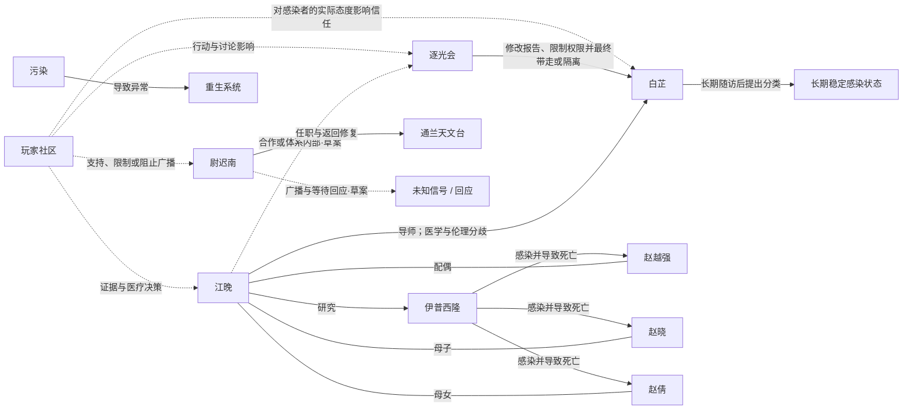

# 人物关系与关系图

状态：**初始草图，持续维护**

本目录用于保存人物、组织、地点、系统和重要现象之间的结构化关系。

机器可读数据见：[relationships.json](relationships.json)。

## 关系数据原则

每条关系应尽量记录：

- 起点 ID；
- 终点 ID；
- 关系描述；
- 确定程度；
- 生效阶段；
- 是否对玩家公开；
- 可能被哪些世界旗标改变。

当前 `certainty` 主要使用：

- `confirmed`：已确认。
- `confirmed_in_character_background`：人物原始背景已确认，但尚未完全整合进全局世界观。
- `confirmed_mainline_direction`：主线方向已确认，具体演出待设计。
- `confirmed_design_goal`：设计目标已确认。
- `draft`：讨论草案。
- `draft_from_background`：从背景推导出的支线草案。

## 当前 Mermaid 草图

该图只是规范和占位，不代表最终人物关系图。

## 江晚与白芷的师生关系

- **江晚 → 白芷**：江晚是白芷的正式导师，负责其专业训练、病例评审与研究方法指导。
- 两人都承认长期稳定病例具有观察价值，但对样本是否充分、结论何时公开以及公共风险如何承担存在分歧。
- 江晚认为错误公开尚未成熟的结论可能造成更大伤亡；白芷认为继续隐藏真实观察正在伤害具体患者。
- 她们的冲突不是正邪对立，而是师生在相同医学原则下，对责任与时机作出的不同判断。

## 白芷其他确认关系

- **逐光会 → 白芷**：逐光会不会因一次质疑立刻逮捕她，而是逐步要求修改报告、限制病例访问、调离项目并开展纪律调查，最终使她被带走、隔离或失踪。
- **白芷 → 长期稳定感染状态**：白芷通过长期随访提出新的临床分类，但没有宣称所有感染者都安全。
- **玩家 → 白芷**：玩家如何对待具体感染者、是否完整提交证据、是否把患者当作工具，会影响白芷的信任与后续选择。

## 后续正式关系图建议

正式关系图可以同时输出两种视图：

1. **作者视图**
   包含隐藏关系、人物秘密、真实立场和未来变化。

2. **玩家阶段视图**
   只显示玩家在特定阶段理论上可能知道的关系，避免剧透。

关系图还可以按阶段生成：

- 余梦期；
- 管制期；
- 疑光期；
- 破晓期；
- 结局后历史图。
