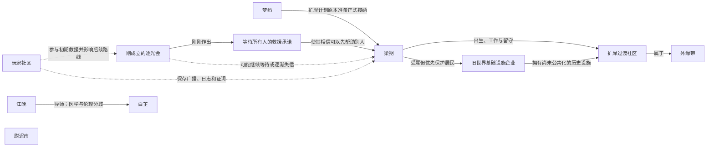

# 人物关系与关系图

状态：**初始草图，持续维护**

机器可读数据见：[relationships.json](relationships.json)。

## 开场时间关系

游戏开场、丧尸危机爆发和逐光会成立处于同一时期。

- 逐光会刚刚成立，尚未完成权力集中；
- 玩家将亲眼参与逐光会最初的救援；
- 梁朔仍在外缘社区留守，尚未抵达梦屿；
- 逐光会刚通过广播承诺等待未完成登记和无法立刻撤离的人；
- 梁朔后续资料丢失、受伤、异常修复与迟到问题应在玩家前期剧情中发生。

## 当前 Mermaid 草图

## 梁朔当前确认关系

- **梁朔 → 扩岸过渡社区**：在此生活、工作，并在危机刚爆发时选择留下维持居民生存设施。
- **梁朔 → 旧世界企业**：企业是危机前雇主，但留守是为了普通居民，不是保护企业资产。
- **逐光会 → 梁朔**：刚成立时承诺等待无法立即撤离的人；后续是否履行由剧情决定。
- **梦屿 → 梁朔**：扩岸计划已准备接纳其本人和社区，危机打断最后程序。
- **玩家 → 梁朔**：保存广播、维修日志、居民证词和预登记资料会影响其最终处境。
